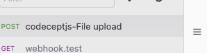
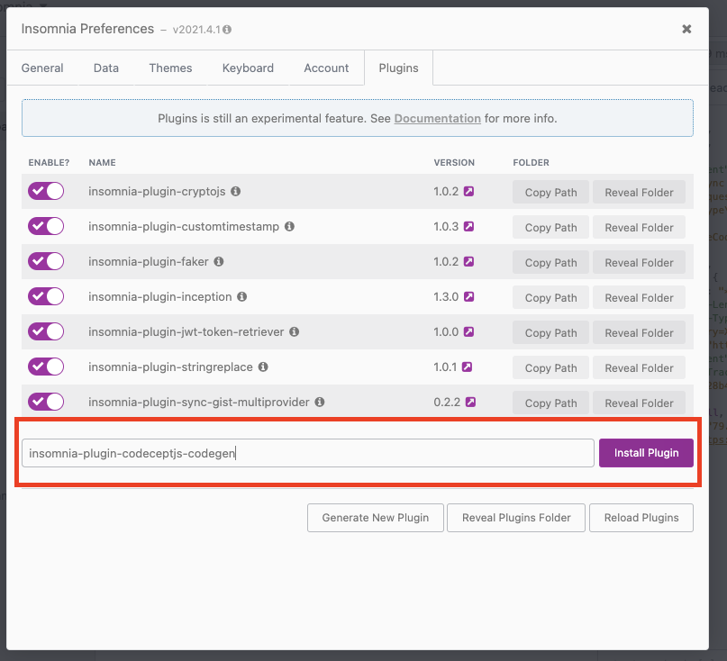
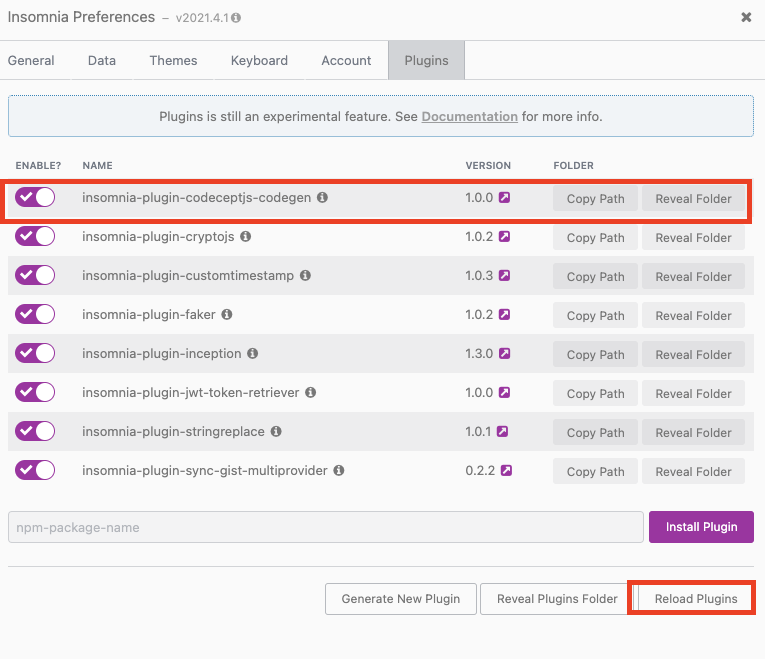
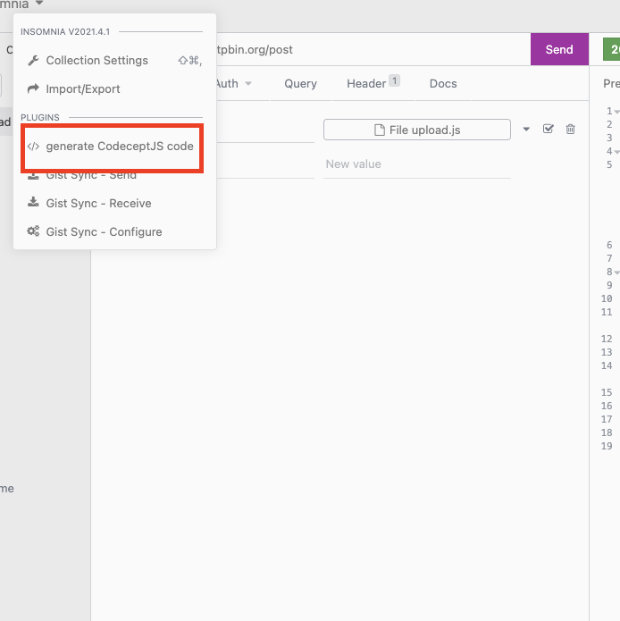

# insomnia-plugin-codeceptjs-codegen
Simple insomnia plugin to export code for every request that names match the prefix to CodeceptJS syntax

NPM package: <https://www.npmjs.com/package/insomnia-plugin-codeceptjs-codegen>

## Usage
- Give a prefix "CodeGen-" for every request you want to export
- 

- Install and reload plugins

- This will export the generated files to `~/Desktop` 

